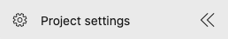
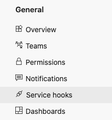
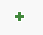
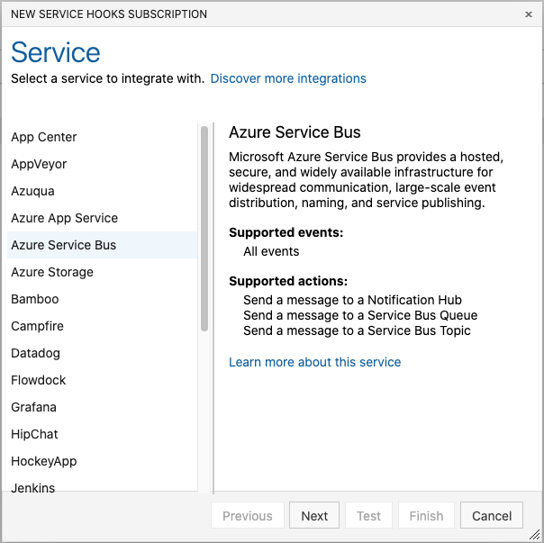
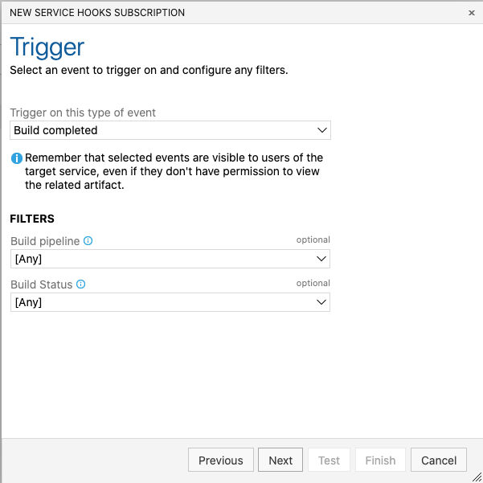
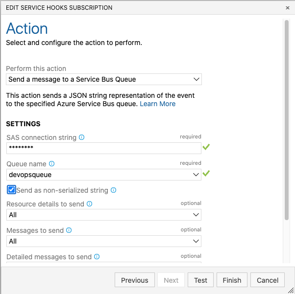
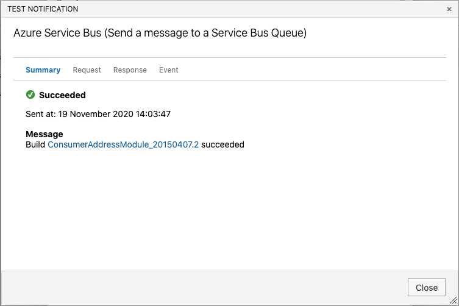

# Installation

0) Install Requirements

* [Install Git](https://github.com/git-guides/install-git)
* A clone of [this repository](https://github.com/newrelic/newrelic-azure-devops-statistics)
* NodeJS + NPM
    * [Windows & Linux](https://docs.npmjs.com/downloading-and-installing-node-js-and-npm)
    * [Mac](https://nodejs.dev/learn/how-to-install-nodejs)
* [Install the Azure CLI](https://docs.microsoft.com/en-us/cli/azure/install-azure-cli)
* [Install the Azure Functions Core Tools](https://docs.microsoft.com/en-us/azure/azure-functions/functions-run-local?tabs=macos%2Ccsharp%2Cbash#install-the-azure-functions-core-tools)

1) Install the Azure CLI for your local operating system: [Install the Azure CLI](https://docs.microsoft.com/en-us/cli/azure/install-azure-cli)

Make sure you are logged into the right Azure Subscription by running `az account show`

2) Decide if you want to use an existing resource group or create a new one to host this function and it's components.

If you want to create a new Resource Group, use the following command. Make sure to replace the location with the one closest to you.

`az group create --name newrelic-devops --location westeurope`

For the instructions we are going to use the Resource Group name `newrelic-devops` as an example. If you chose a different name, make sure to replace that in the future commands.

3) Create an Azure Service Bus Namespace for use with the New Relic DevOps Function

`az servicebus namespace create --resource-group newrelic-devops --name newrelicservicebus --location westeurope`

4) Create a Queue within our Azure Service Bus Namespace

`az servicebus queue create --resource-group newrelic-devops --namespace-name newrelicservicebus --name devopsqueue`

5) Create a primary connection string for the namespace. **Make sure to save this value, as we will use it in next steps.**

`az servicebus namespace authorization-rule keys list --resource-group newrelic-devops --namespace-name newrelicservicebus --name RootManageSharedAccessKey --query primaryConnectionString`

6) Set-up Azure DevOps Service Hook with the primary connection string.

Open your Azure Devops Web UI and click on `Project Settings` in the bottom left:

In your Project settings, click on Service Hooks:

In Service hooks, click on the green + button: 

Choose the Service you want to connect to, in our case this is `Azure Service Bus` and click `Next`:

In the Trigger screen, select the type of events you want to retrieve. New Relic currently supports `Build completed`, `Release created` and `Release deployment completed`. Click `Next`.

On the `Action` screen, change `Perform this action` to `Send a message to a Service Bus Queue`.

Also add your `primary connection string` from step 5 to the `SAS connection string` field without the `"`. When done succesfully you should be able to select the queue we created from the `Queue name` dropdown. Enable `Send as non-serialized string`. Leave everything else as is. Now click on `Test` to test the connection.

If everything is done succesfully, you should see this screen:

This means you have configured everything currectly. Please redo all these steps for any other event you want to configure, and for every project you want to monitor.

7) Optional: Check if Service Bus Queue has items:

`az servicebus queue show --resource-group newrelic-devops --namespace-name newrelicservicebus --name devopsqueue`

You should see `activeMessageCount` with a number above 0. If not, check your steps from above.

8) Create an Azure storage account for the Azure Function App

`az storage account create --name newrelicdevops1234 --location westeurope --resource-group newrelic-devops --sku Standard_LRS`

If you get a message that the storage account already exists, change the numbers after `--name newrelicdevops` to something else, for example `--name newrelicdevops5678`. Remember the name of your storage account as we will need it in the next step.

9) Configure Azure Function App

`az functionapp create --name newrelic-devops-functions --storage-account newrelicdevops1234 --consumption-plan-location westeurope --runtime node --resource-group newrelic-devops --functions-version 3`

10) Install Azure functions CLI

You can find the instructions on Microsoft docs: [Install the Azure Functions Core Tools](https://docs.microsoft.com/en-us/azure/azure-functions/functions-run-local?tabs=macos%2Ccsharp%2Cbash#install-the-azure-functions-core-tools)

11) Set-up the environment

Please run the following commands, but don't forget to replace the `{{  }}` fields with your own values.

`az functionapp config appsettings set --name newrelic-devops-functions --resource-group newrelic-devops --settings "NEWRELIC_ACCOUNT_ID={{REPLACE_ME_WITH_NEWRELIC_ACCOUNT_ID}}"`

`az functionapp config appsettings set --name newrelic-devops-functions --resource-group newrelic-devops --settings "NEWRELIC_INSERT_KEY={{REPLACE_ME_WITH_NEWRELIC_INSERT_KEY}}"`

`az functionapp config appsettings set --name newrelic-devops-functions --resource-group newrelic-devops --settings "AzureWebJobsServiceBus={{REPLACE_ME_WITH_PRIMARY_CONNECTION_STRING}}"`

If your New Relic account is in the EU datacenter, please run the following to send the data there:

`az functionapp config appsettings set --name newrelic-devops-functions --resource-group newrelic-devops --settings "NEWRELIC_DATACENTER=EU"`

12) Deploy the Azure function

`cd AzureDevops2NewRelic && npm install && cd ..`

`func azure functionapp publish newrelic-devops-functions`

13) Done
